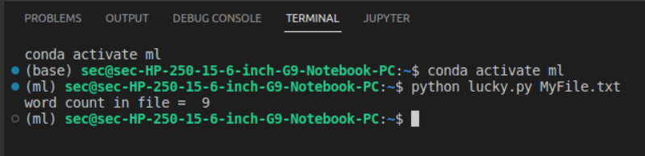

# command-line-arguments-to-count-word
## AIM:
To write a python program for getting the word count from the contents of a file using command line arguments.
## EQUIPEMENT'S REQUIRED: 
PC
Anaconda - Python 3.7
## ALGORITHM: 
Step 1:
Give file name to read

Step 2:
Now read the content in the file

Step 3:
use split()

Step 4:
Now read the no.of words in file

Step 5:
Print number of words present in given file

Step 6:
End of the program

## PROGRAM:

Developed by:sarvesh.s

RegisterNumber: 22003029

```
import sys
count= 0
with open(sys.argv[1],'r') as f1:
    for line in f1:
        word= line.split()
        count += len(word)
print("word count in file = ",count)
```

### OUTPUT:


## RESULT:
Thus the program is written to find the word count from the contents of a file using command line arguments.
